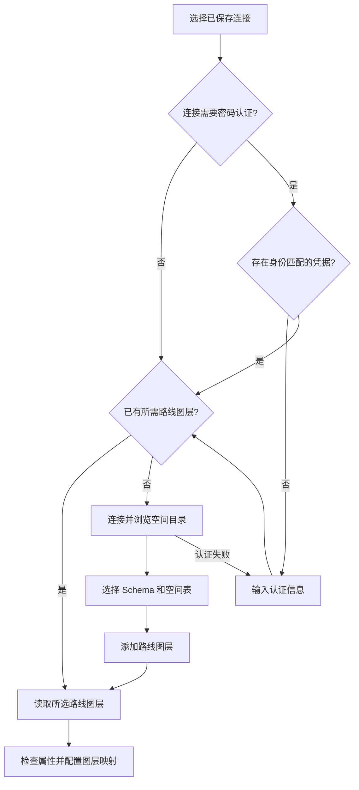

# 数据连接与路线图层流程改造

> 历史改进记录：本文的实现状态、数量上限、部署路径与验证结果对应文件名标明的日期。当前技术架构和能力边界见 [架构](architecture.md) 与 [能力清单](workbench-capabilities.md)。

## 原有问题

保存连接只代表公开配置已登记，并不代表已认证或已有路线表。原界面把已登记图层当作可浏览目录，尚无图层时仍显示读取按钮；添加图层又回到完整连接表单，需要手工填写 Schema 和表名。密码可在当前会话复用；本轮新增的目标是通过 Windows Credential Manager 在用户选择记住密码时跨应用重启复用。

## 新流程

1. 在管理窗口新建或编辑命名连接。只配置数据库、用户、连接范围及安全参数，不要求表名。
2. 选择连接。先按连接 UUID 查找已保存凭据，并核对其公开配置身份；没有可用凭据时显示认证输入。凭据可来自 Credential Manager 或本次会话，已提供并不代表服务器认证已通过。
3. 点击“连接并浏览空间表”。成功后显示 Schema、空间表或 WFS 要素类型目录；刷新使用当前会话凭据。若启用记住密码，数据库认证成功后将凭据写入 Credential Manager。数据库范围与已添加路线图层分别显示。
4. 显式选择 Schema 和空间表，再点击“添加所选路线图层”。目录不会自动选表或导入数据。已登记的目标直接选中，不重复添加；同表多个几何列分别标识。
5. 点击“读取所选路线图层”。沿用现有 CRS 检查和导入限制，读取后配置并保存该图层独立的字段映射。当前会话继续复用凭据；此时无需再次认证。
6. 手动登记保留为次要入口，只编辑目标 Schema、表、几何列或要素类型，不重复编辑连接参数。

已有路线图层可直接选择并读取，不要求每次重新浏览目录。连接配置已保存、凭据已提供、服务器认证成功、路线数据已读取是不同状态；界面不能仅因连接名称已保存就宣称连接成功。

## 密码持久化策略与验收状态

记住密码默认开启；旧连接未保存 `rememberPassword` 时按开启处理。该偏好随公开连接配置保存在本机 WebView2 配置库，密码本身不进入 localStorage、工程文件或来源指纹。Windows 上的密码由 Windows Credential Manager 加密保存，凭据服务名为 `com.roadgeometry.lujing.database`，凭据 ID 使用连接 UUID，凭据内容为 JSON `{identity, password}`。读取凭据后必须比对当前连接身份；身份不匹配时删除旧项并要求重新认证。连接身份变化由数据库类型及公开连接参数决定，不包括名称、图层或记住密码偏好。

在管理窗口保存连接时，若用户提供了密码且记住密码开启，将它写入凭据管理器；主面板目录浏览或路线读取成功后也写入。管理窗口的测试连接仅验证，未提交的新密码须点击保存连接才持久化。关闭记住密码会删除对应的已保存凭据，但本次会话中的密码仍可继续用于连接和读取。更改主机、数据库、用户、范围或安全参数时删除旧身份的凭据；复制连接使用新 UUID，不继承原凭据；删除连接时清理其凭据。工程文件只携带业务映射和非敏感来源标识，不携带连接配置或密码。

Credential Manager 实机读写与应用重启恢复已通过下述独立验收，不代表安装器部署已验收。公开配置先确认可写，再操作系统凭据；系统操作失败时恢复旧公开配置并报告失败。目录结果仍检查连接 ID 和公开配置身份，配置改变后不显示旧目录；浏览失败清除当前目录并提示重试，不改变工程成果。

## 目录读取与筛选

PostgreSQL 通过只读系统目录查询可使用的 Schema（包含空 Schema）、可 SELECT 的 geometry/geography 列，不通过拆分名称猜测默认 Schema。指定 Schema 的连接只返回该范围；同表多几何列分别返回。普通 PostgreSQL 无空间列时返回空空间目录。其他数据库、GeoPackage、SpatiaLite 和 WFS 从 GDAL/OGR 元数据读取，禁止目录阶段计算要素数量或范围。

界面排除已知点、面及几何集合，保留线和未确定类型；未确定类型仍需读取阶段校验，不能将其当作已确认的道路。目录有超时与数量上限，超限明确失败，不悄悄截掉可选表。字段映射继续按连接与图层保存，已有工程和映射格式兼容。

PostGIS 读取使用精确引用的 Schema / 表名、选中几何列及非几何业务字段，避免重复列导致 CRS 丢失。SRID 通过空间参考目录解析其真实 authority 或 WKT，不直接当作 EPSG 编号。未约束 SRID 的列先使用有限样本定位 CRS，再逐条核对本次有界读取批次的实际 SRID；混合或未知 SRID 明确失败。临时校验字段避开业务字段名，返回前移除。该检查只覆盖实际读取批次，不宣称已验收未读取的整张表。

## 验证范围

既有单元测试覆盖认证需求、连接身份变化、会话隔离、显式空密码、图层去重键、目录筛选及 PostgreSQL 类型声明。此前桌面回归覆盖本地 GeoPackage 与独立本机 PostGIS 测试库的目录浏览、选择、添加和读取，并检查密码不持久化；该结果属于本次持久化改动之前，不能作为 Credential Manager 行为的验证证据。

用户截图中的生产服务器尚未实测；SQL Server、Oracle、远程 WFS 的实际服务器目录仍需在具备驱动和有效连接时验收。密码持久化验证见下方；系统凭据访问被拒绝、系统存储损坏等异常环境未作实机故障注入。独立安装器和干净 Windows 部署不属于已完成验收范围。

最终验证：35 项前端测试、27 项 Rust 桌面端测试、90 项真实桌面回归通过，浏览器错误 0；TypeScript、Prettier、cargo fmt/clippy 及 Windows 便携构建通过。报告位于 `artifacts/maplibre-qa/20261003-150228-003/report.json`，关键截图为 `37-postgis-schema-picker.png` 和 `38-postgis-ready-to-read.png`。新版程序为 `artifacts/maplibre-desktop/debug/build-20261003-150224-482/lujing-desktop.exe`。验证使用独立本机测试库和合成数据，测试实例已停止。

密码持久化改动验证：37 项前端测试、30 项常规 Rust 测试通过，另实际执行 1 项 Windows 原生凭据往返测试；TypeScript、Prettier、cargo fmt/clippy 与便携构建通过。最终桌面回归 81 项通过，浏览器错误 0，报告 `artifacts/maplibre-qa/20261003-153238-731/report.json`，本轮未启用数据库服务器可选分支。独立凭据脚本通过 UI 保存合成连接，再关闭并启动第二个桌面进程，11 项检查覆盖自动恢复、公开配置无密码、关闭保存后清除、重载要求认证、UUID 隔离、身份失效、空密码、重复删除及配置写入失败保留旧凭据；报告目录 `artifacts/credential-qa/20261003-153245-940`。合成凭据均已清理。最终程序为 `artifacts/maplibre-desktop/debug/build-20261003-153235-394/lujing-desktop.exe`。
